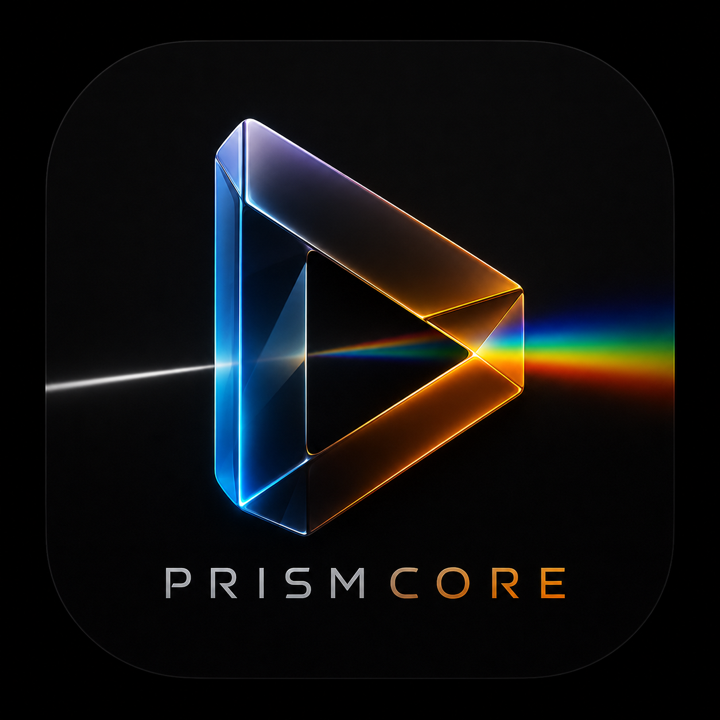

<p align="center">
  
</p>

# PrismCore

Aether's native playback engine core: **FFmpeg demuxes, Apple plays.**

Any container libavformat can read (MKV, MPEG-TS, AVI, …) is remuxed on the
fly into **HLS-fMP4**, served from a loopback HTTP server on `127.0.0.1`, and
handed to a plain `AVPlayer` as a playlist URL. Apple's stack then does what
only it can do on its own platforms:

- **hardware decode** (VideoToolbox),
- **Dolby Atmos passthrough** — EAC3+JOC is stream-copied, never decoded to PCM,
- **Dolby Vision** display engagement and the HDMI handshake,
- **Match Content** (frame rate + dynamic range) on tvOS,
- system-side HDR10/HLG tone-mapping.

The engines Aether ships today split this down the middle: Lumen (AVPlayer)
has all of the above but only Apple's containers; Prism (libmpv) plays
everything but renders its own frames and decodes audio to PCM, so Atmos and
DV die at its door. PrismCore exists to close that gap.

## Two engines, one entry point

`PrismCoreEngine.open(url:)` probes the source, picks the engine and hands back
something already started:

```swift
switch try await PrismCoreEngine.open(url: mkvURL) {
case .remux(let session, let playlist):
    player.replaceCurrentItem(with: AVPlayerItem(url: playlist))   // AVPlayer plays it
    …
    await session.stop()
case .software(let pipeline):
    hostView.layer.addSublayer(pipeline.displayLayer!)             // we play it
    pipeline.play()
    …
    pipeline.stop()
}
```

The remux path is the one that matters — it is what buys hardware decode, Atmos
passthrough and Dolby Vision — and everything below describes it. The software
path exists for containers whose *video* AVPlayer cannot decode at all (VP9,
MPEG-2, VC-1), where there is no URL to hand anywhere; see phase 7.

## The remux path: a service, not a player

Deliberately narrow — no view, no transport, no published state:

```swift
let session = try PrismCoreSession(url: mkvURL)   // or with HTTP headers

// optional, before start(): a sidecar joins the WebVTT renditions (phase 6)
try await session.addExternalSubtitle(url: srtURL, language: "cs", name: "Čeština")

let playlistURL = try await session.start()       // .../master.m3u8 or .../index.m3u8
// hand playlistURL to AVPlayer (Aether: the Lumen path plays it)
…
await session.stop()
```

The URL is a **master** playlist when the source has audio (that is where the
selectable audio renditions live) and the media playlist when it hasn't. Treat
it as opaque: the shape is a property of the source.

No view, no transport, no published state — the host's existing AVPlayer
infrastructure stays in charge. The engine grows inward from there (see
Roadmap).

## Architecture (v0)

```
                                    ┌─► video ──► fMP4 segments + index.m3u8
Source URL ──► libavformat demux ───┼─► audio 0 ─► audio0/{init.mp4,seg*.m4s,index.m3u8}
                                    └─► audio N ─► audioN/…        │  tmp dir
                                              master.m3u8 ─────────┤
                                                                   ▼
                                                    LoopbackHTTPServer ──► AVPlayer
```

Every viable audio track of the source becomes an HLS **alternate rendition**:
its own fMP4 writer, its own media playlist, its own subdirectory, all wrapped
by a `master.m3u8` whose `EXT-X-MEDIA` lines carry the tracks' names, languages
and channel counts. That is what gives AVPlayer an `AVMediaSelectionGroup` to
switch on — parity with the libmpv player PrismCore replaces, whose track menu
the host app already exposes. Audio cuts follow the **video's** segment
boundaries so the renditions stay comparable, which is what HLS asks of them.

An Atmos track declares `CHANNELS="16/JOC"` rather than its bed's channel count
(which reads 6). The declaration is not cosmetic: the objects reach an AVR either
way, since the stream is copied untouched and the receiver is what decodes JOC —
but without it AVFoundation cannot know the rendition is Atmos, so it can't
prefer it in a selection group and tvOS won't badge it. It is claimed **only**
for stream-copied EAC3+JOC, never for the audio bridge's output: that path
decoded to PCM and re-encoded with an encoder that produces no JOC, so it is
surround, not Atmos.

The playlist attribute is necessary but it is **not what engages Atmos**.
AVFoundation takes the Dolby/MAT route only when the **`dec3` box** in the init
segment carries the TS 103 420 type-A extension (`flag_ec3_extension_type_a` +
`complexity_index_type_a`); without it the same bitstream plays as plain DD+.
That is a device finding rather than a spec reading — Aether's own remuxer paid
for it (#976 step-0) — and PrismCore doesn't write the box itself, FFmpeg's
`movenc` does, from frames it accumulates while muxing. Under `delay_moov` the
moov is written after only the first few frames, which is exactly where a
frame-accumulating writer can come up short, so `EAC3Configuration` reads the
box back out of the produced init segment instead of trusting it. What a
synthetic fixture can prove is pinned by a test (the box exists, frames
correctly, describes the right bed); that the extension survives a stream-copy
needs a real Atmos file and a device.

Dolby Vision Profile 5 gets `dvh1` as its **sample entry fourcc**, not just in
the manifest's `CODECS`. P5 has no base layer — the picture is IPT-PQc2, not
YCbCr — and the sample entry is the only thing that tells a decoder so, which is
why an `hvc1` entry over P5 renders the familiar green-and-purple picture. It
would also contradict the `dvh1.05.xx` the master declares, a mismatch AVPlayer
checks the manifest against. Profile 8.x deliberately keeps `hvc1`: its base
layer really is plain-HEVC-compatible and the `dvvC` box is what upgrades it, so
claiming `dvh1` there would deny the very fallback that makes 8.1 worth having.

A source whose master playlist can't be written honestly (no derivable `CODECS`
string, or a dynamic range this display hasn't been vouched for — see
`PrismCoreSession`'s `displayIsHDRReady`) falls back to v0's shape: one audio
track muxed into the video's own segments, media playlist served directly.
Renditions only exist inside a master, so no master means the audio rides
inside the variant.

**AV1 is the one codec whose eligibility depends on the device, not the source.**
Apple's hardware AV1 decoder arrived with the A17 Pro and the M3, and there is no
software AV1 decoder behind VideoToolbox — Safari plays AV1 on an M1 or M2 through
its own dav1d, not through the system. So on those chips (Vision Pro's M2
included) an AV1 variant offered to `AVPlayer` doesn't play *slowly*, it doesn't
play. `HardwareDecodeSupport.isAV1Supported` asks the device with
`VTIsHardwareDecodeSupported` rather than inferring from a chip name, and where
the answer is no, AV1 routes to the software path and libdav1d — which is the only
way it plays there at all. Neatly, that makes visionOS both the platform that
needs the software path most and the one where its unfinished parts (subtitles,
track switching) matter most.

The loopback server speaks HTTP/1.1 with keep-alive (bounded per connection and
by an idle timeout), `GET` + `HEAD`, and pipelined requests. Payloads come from a
`SegmentProvider` rather than straight off disk: `DirectorySegmentProvider` is
the v0 implementation, and a provider that answers `.pending` gets an early
`200` + `Transfer-Encoding: chunked` once a serve passes 2 s — keeping response
headers inside AVPlayer's ~3.5 s media watchdog window. A pending serve that
ultimately fails aborts the connection (truncated transfer → AVPlayer retries)
instead of framing a cacheable empty `200`. Phase 5's `PlanSegmentProvider`
plugs into that seam: a fetch of a planned-but-unproduced segment becomes a
producer re-anchor (via `DemandCoordinator`) plus a pending serve that waits
for the file to land.

The segmentation is ours: MPVKit's libavformat is built without the `hls`
muxer, so `FMP4SegmentWriter` drives the `mp4` muxer with `frag_custom` and cuts
where we say (video keyframes at/after each 6 s boundary), and
`MediaPlaylistWriter` turns those fragments into a playlist. Two production
modes exist:

- **Planned (demand-driven, phase 5)** — the default for seekable VOD.
  `SegmentPlan` maps every segment upfront from the demuxer's keyframe index
  (trusted only past two witnesses: max keyframe gap 60 s, coverage ≥ one
  target duration), complete `PLAYLIST-TYPE:VOD` playlists are published
  before the first packet, and a fetch outside the producer's window
  re-anchors it — `av_seek_frame` to the anchor keyframe, fresh muxers with
  `frag_discont` + `avoid_negative_ts=disabled` so `tfdt` carries absolute
  time and the produced segment sits exactly where the playlist promised.
  After EOF the producer parks and keeps answering demand for segments a
  re-anchor skipped, until the session stops.
- **Sequential (v0, kept)** — EVENT playlist growing head-to-EOF, gaining
  `EXT-X-ENDLIST` at the end. Used when no trustworthy plan exists (live /
  unknown duration / junk index → uniform basis) and for the
  muxed-with-bridge shape (re-anchoring would reset an encoder mid-fragment).

### Subtitle timing (`X-TIMESTAMP-MAP`)

WebVTT cue times are local to their file, so HLS bridges them to the media
timeline with `X-TIMESTAMP-MAP=MPEGTS:<t>,LOCAL:<local>`, where `t` sits on a
90 kHz axis whatever timescale the media segments use. Our fMP4 segments carry
the source's own stream-copied timestamps, so the media timeline starts at the
first video PTS — there is no MPEG-TS 10 s convention to honour, and assuming one
is exactly what makes fMP4 subtitle tracks render ten seconds late in other
implementations. PrismCore therefore writes cue times **relative to the
presentation origin** and repeats
`MPEGTS:round(origin × 90000),LOCAL:00:00:00.000` in every segment: `MPEGTS:0`
for an ordinary file starting at PTS 0, `MPEGTS:900000` for a mid-stream capture
that really does start at 10 s. The map states a fact about the output rather
than a convention.

## Roadmap

**End goal: replace Prism (libmpv) in Aether.** Until every phase lands,
routing is additive — sources PrismCore can't take yet keep falling back to
Prism, and Prism retires only at parity.

1. **v0 (this)** — stream-copyable A/V (HEVC/H.264/AV1 + AAC/AC3/EAC3/FLAC/ALAC),
   loopback server, event playlist. Plays an MKV remux with Atmos intact —
   which is already the bulk of what Prism handles in the wild. **Multi-audio**
   landed here rather than later: every viable audio track is served as an
   alternate rendition behind a master playlist, because a host whose track menu
   can only offer one track is not at parity with the player it replaces.
2. **Aether integration** *(attempted 2026-08-05, parked on two build-level
   prerequisites)* — `PlayerTransport` routing behind a developer toggle; HTTP
   headers for server sources; teardown discipline. The routing itself is
   straightforward and was written (Aether branch `feature/prismcore-routing`,
   unmerged): every *automatic* tier-3 libmpv route offers the source to
   PrismCore first and falls back to exactly the route it would have taken, so
   the phase is additive. What stopped it is entirely about how the two packages
   share MPVKit, and both prerequisites belong to the host, not here:

   - **SPM package identity.** PrismCore depends on
     `github.com/mpvkit/MPVKit.git` → identity `mpvkit`. Aether overrides MPVKit
     with a local fork at `Vendor/MPVKitLocal` → identity `mpvkitlocal`, taken
     from the *directory name*. A local package only overrides a remote one of
     the **same** identity, so resolution fails outright with `unable to
     override package 'MPVKit' because its identity 'mpvkit' doesn't match
     override's identity (directory name) 'mpvkitlocal'`. The host's fork
     directory has to be named `MPVKit` (or PrismCore has to be vendored beside
     it with its own path dependency, which sidesteps identity entirely).
   - **A stale module map in the pinned FFmpeg build.** MPVKit's
     `Libavutil.framework` module map excludes the platform `hwcontext_*.h`
     headers it can't build — but the list predates AMF, so `hwcontext_amf.h`
     survives and `#include <AMF/core/Factory.h>` fails. Nothing in Aether ever
     imported `Libavutil` as a module, so it never noticed; PrismCore does, and
     the module then can't be built at all. Aether pins the FFmpeg xcframeworks
     from MPVKit release `0.41.0`; release `1.0.0` (still mpv v0.41.0) is what
     PrismCore's own tests run against, and it does not have the problem.
     Bumping those pins is a change to every libmpv playback in the host, which
     is why it is the host's call and not a detail of this phase.

   The agreed sequence is therefore: let PrismCore mature standalone, and do the
   wiring — including the MPVKit bump — in a dedicated test build of the host.
3. **Audio bridge** *(implemented, needs a media fixture + a device)* — TrueHD /
   DTS / DTS-HD MA / MP3 / MP2 / Opus / Vorbis / PCM → EAC3 (decode +
   re-encode, 128 kbps per channel) so non-streamable audio still surrounds on
   the native path. Requires an FFmpeg built with the `eac3` **encoder**: stock
   MPVKit ships only the ac3/eac3 decoders, so until Aether's MPVKit fork adds
   `--enable-encoder=eac3` the bridge reports itself unavailable and routing
   keeps v0's fallback to a copyable audio track.
4. **DV + HDR signaling** *(implemented; the DV claims need a device)* — the
   master playlist carries honest `CODECS` / `SUPPLEMENTAL-CODECS`, and all four
   of the phase's parts are in:
   - `SourceProbe` reports what the source is and whether PrismCore can take it;
     `MasterPlaylistBuilder` holds the signaling rules as pure
     value-in/string-out logic pinned by unit tests.
   - **`hvcC` normalization** (`HVCCNormalizer`) — a stream-copied HEVC track is
     given a `hvc1` sample entry **explicitly** (`codec_tag`), because FFmpeg's
     mp4 muxer defaults HEVC to `hev1` and Apple's HLS rules want `hvc1`. That
     matters twice over: `hvc1` asserts every parameter set lives in that
     entry. Matroska `CodecPrivate` routinely says otherwise
     (`array_completeness=0`) and carries SEI arrays besides, so the record is
     rewritten to VPS/SPS/PPS in order with completeness asserted. This runs
     **twice**: once on the input extradata, which decides which parameter sets
     exist, and again on the produced init segment — FFmpeg's `mp4` muxer does
     not copy our record into the sample entry, it rebuilds one and re-zeroes
     `array_completeness` while still naming the entry `hvc1`. (Which the
     end-to-end test found by reading the served `init.mp4`, after the
     input-side pass alone was assumed to be enough.) The 22-byte
     profile_tier_level header is copied verbatim either way — it is what the
     `CODECS` string is printed from, so the declaration keeps matching the init
     segment.

     A real Matroska file later showed the fourcc and the normalization to be one
     problem rather than two: `array_completeness = 1` contradicts `hev1`, and
     movenc resolves that by writing **no `hvcC` box at all** — so before the tag
     was set explicitly, normalizing a real record deleted it. The synthetic
     fixture couldn't catch it: its record already had completeness set, so the
     normalizer left it alone.
   - **Atmos needs the `dec3` box written by us.** FFmpeg's mp4 muxer drops the
     TS 103 420 type-A extension on a stream copy (plain `ffmpeg -c copy` does
     the same), and that extension is the only thing that makes AVFoundation
     take the Dolby/MAT route — without it a real Atmos track plays as plain
     DD+. So `EAC3Syncframe` reads `complexity_index_type_a` out of the
     bitstream's `addbsi` and `EAC3Configuration.patch` appends it to the box in
     the produced init segment, re-framing every enclosing box's size. Only for
     stream-copied tracks the probe called object audio: the bridge decodes to
     PCM and its encoder produces no JOC, so declaring Atmos there would promise
     what the bridge destroyed. Verified on Dolby's Atmos demo — the served
     `dec3` now declares complexity index 16.

     Field placement follows libavcodec's `ac3_parser.c`, not a reading of the
     spec, and that mattered three times over: the JOC signal can sit in a
     **dependent** substream (Blu-ray-style DD+ puts it there, behind an AC-3
     core frame, so a reader that parses only offset zero finds nothing), a
     dependent substream carries a `chanmap` field an independent one doesn't,
     and both the converter-sync bit and the whole mixing-substream block exist
     on independent substreams only. Each omission shifted the walk by a bit or
     two — and a shifted walk does not fail, it returns a confident wrong
     number. An early version reported a plausible index from a misaligned read;
     only matching the reference implementation field for field made it right.
   - **Parameter sets get harvested when the source keeps them in band.** Some
     MP4 and MPEG-TS sources ship a 23-byte `hvcC` with `numOfArrays = 0` — their
     VPS/SPS/PPS travel with the samples. The record parses, so a `CODECS` string
     can be derived from it, but FFmpeg writes an **empty** `hvcC` box and an
     `hvc1` entry then promises parameter sets that aren't there, leaving AVPlayer
     nothing to configure a decoder from. So they are collected off the first
     keyframes and filled into the record when the init segment is written
     (`HVCCNormalizer.record(fillingIn:withParameterSets:)`), keeping the
     22-byte profile_tier_level header verbatim so the manifest's claim still
     describes the media.
   - **The Dolby Vision box needs `-strict unofficial`.** `dvcC`/`dvvC` are
     Dolby's specification rather than ISO's, so movenc refuses to write them by
     default ("Not writing 'dvcC'/'dvvC' box. Requires -strict unofficial") — and
     they are the only thing that tells AVFoundation a track is Dolby Vision. A
     DV source without them is HDR10 with extra bytes. Also invisible to every
     fixture, since none carries DV.
   - **P7 → 8.1 RPU conversion** (`DolbyVisionRPUConverter`) — Profile 7 is
     dual-layer with an HDR10 base no Apple platform decodes as DV. libdovi
     (already linked into MPVKit's `_FFmpeg`) rewrites each RPU NAL to its
     single-layer 8.1 form and the enhancement layer's NALs are dropped, so the
     stream becomes a `dvh1.08.xx/db1p` claim over its own untouched base
     pictures. Behind `canImport(Libdovi)`: a build without the module reports
     the converter unavailable and P7 keeps routing to Prism.
   - **The panel read** (`DisplayCapabilities.current()`) — `AVPlayer
     .availableHDRModes` on iOS/tvOS/visionOS, `NSScreen`'s potential EDR
     headroom on macOS, replacing the caller-supplied `displayIsHDRReady` /
     `displayIsDolbyVisionCapable` guess. Use
     `PrismCoreSession.readingCurrentDisplay(url:)`. macOS never claims DV on
     purpose (no HDMI handshake to engage, and the 8.1 base already plays
     through EDR).
   - **Master-rejection fallback** (`MasterRejection`) — `-11868` / `-11848` /
     `-1002`, matched across error domains and through
     `NSUnderlyingErrorKey`. `PrismCoreSession.isMasterRejection(_:)` tells a
     refused master apart from an unplayable source, and
     `makeMuxedFallbackSession()` mints the media-direct retry (external
     subtitle registrations replayed). This is the half that catches the panel
     read being optimistic: no API distinguishes a Match-Content display from an
     HDR-capable one parked in SDR.
5. **Seek & cache** *(implemented)* — keyframe-aligned `SegmentPlan`,
   planned VOD playlists, demand-driven producer with re-anchoring and
   absolute-`tfdt` restart continuity, EOF parking, byte-budgeted retention
   (`segmentCacheBytes`, default 1 GiB; planned mode only — an evicted
   segment is reproduced on demand, so the budget bounds disk, not
   seekability). `forceMuxedShape` is the host's master-rejection fallback:
   on -11868 / -11848 / -1002, make a NEW session with it set.

   Subtitles across a re-anchor were the last open item here and are now closed.
   A planned `.vtt` for a range nobody has demuxed used to be answered with an
   empty segment *immediately*, which was safe but wrong in the common case: the
   fetch that arrives alongside it is AVPlayer asking for the media segment of
   the same index, which re-anchors the producer, so the cues are a second or two
   away — and because AVPlayer caches segments and never re-fetches, answering
   empty straight away is what made subtitles resume only from the segment
   *after* a seek. `PlanSegmentProvider` now waits
   (`subtitleProductionTimeout`, 8 s) and degrades to the empty segment only if
   the range genuinely never lands. A subtitle serve never aborts the connection
   the way a media serve does: empty cues beat a failed rendition.
6. **Subtitles** *(text half implemented)* — every text subtitle stream
   (SubRip / ASS / SSA / WebVTT / mov_text) is converted during the remux read
   loop into a segmented WebVTT rendition (`subs<N>/seg%05d.vtt` +
   `subs<N>/index.m3u8`) cut on the video's own segment boundaries, so text
   survives PiP / AirPlay instead of living in a host overlay. External `.srt` /
   `.vtt` files register with `PrismCoreSession.addExternalSubtitle(url:…)`
   before `start()` and become renditions the same way. The renditions are
   declared `DEFAULT=NO,AUTOSELECT=NO` in a `SUBTITLES` group so AVKit never
   engages one by itself — the host selects it in the legible
   `AVMediaSelectionGroup`. Bitmap subtitles (PGS/DVB/DVD) are out of scope
   here: `SourceProbe` reports them (`SourceInfo.bitmapSubtitleTracks`) so the
   host can render them in its own overlay, and an OCR-fed rendition is a later
   idea, not this phase.
7. **Software decode path** *(implemented and routed; needs a device)*
   — libavcodec → `AVSampleBufferDisplayLayer`/`AVSampleBufferAudioRenderer`
   under an `AVSampleBufferRenderSynchronizer` for what the HLS-fMP4 pipeline
   can't carry (VP9/VP8, MPEG-2/VC-1/MPEG-4 ASP, interlaced H.264 +
   deinterlace). This is the phase that lets Prism — and with it the entire
   libmpv dependency — retire.
   *Landed:* `Sources/PrismCore/Software/` — `SoftwareVideoDecoder` (frames as
   `CMSampleBuffer`s of `CVPixelBuffer`s; zero-copy through the VideoToolbox
   hwaccel where MPVKit's build has one, which includes VP9, with a CPU decode
   + NV12/P010 conversion fallback), `SoftwareAudioDecoder` (LPCM buffers whose
   timestamps come from a running sample count, not from container-quantized
   PTS — see `AudioClock`), and `SoftwarePlaybackPipeline` (demux + both
   decoders + renderers + master clock, with `load/play/pause/seek/stop`).

   **Routing** is `PrismCoreEngine.open(url:)` — one call that probes, decides
   and hands back a started engine (`.remux(session:playlist:)` or
   `.software(pipeline:)`). Deliberately *not* folded into `PrismCoreSession`
   the way this line used to promise: a session is a work directory, a loopback
   server, a segmenting remuxer, a demand coordinator and a disk budget, and the
   software path needs none of them — putting it there would allocate a temp
   directory and bind a port per software-decoded title, and make `start()`
   return a URL that doesn't exist for half its cases. `decide(for:)` is exposed
   separately so the rules are testable without standing up either engine.

   One case got *better* rather than merely possible: a source whose audio all
   needs the missing EAC3 encoder (TrueHD, DTS-HD MA) used to have only bad
   answers — remux it and serve silent video, or hand it back. The software path
   decodes that audio itself, so it now plays with sound. No passthrough, so no
   Atmos, but sound; and when a build *does* have the encoder, the bridge keeps
   the native path instead.

   Still open in this phase: deinterlacing (so interlaced H.264 is deliberately
   still routed to the native path rather than here — no point claiming a
   deinterlace that doesn't exist), subtitles, track switching, and
   frame-accurate seek.

## Dependencies

FFmpeg arrives through [MPVKit](https://github.com/mpvkit/MPVKit)'s LGPL
dynamic xcframeworks — the same dependency Aether already ships, with the
same LGPL obligations already met.

## Status

Early scaffold. `swift build` / `swift test` on macOS exercise the playlists,
server, subtitle-rendition, and audio-bridge pieces (the bridge's decode →
resample → FIFO → encode chain runs end to end in tests over synthesized LPCM),
plus end-to-end remuxes of synthetic fixtures: a two-language master (AAC eng +
AC3 ces) is served over the loopback, re-probed through libavformat's hls demuxer
with both codecs and both languages intact, and reaches `.readyToPlay` in a real
`AVPlayer`. What fixtures can't carry still needs a device: the Atmos and Dolby
Vision claims, actual track *switching* in AVKit's audio menu, and the EAC3
output the bridge produces (which needs an FFmpeg build with that encoder
enabled).

Worth being precise about those two headline claims, because "implemented" and
"working" are not the same thing here. **Atmos**: EAC3+JOC stream-copies (proved
on a fixture — the codec survives the remux round-trip) and the rendition now
declares `CHANNELS="16/JOC"` (the rule is unit-tested). Whether the objects
actually reach a receiver over HDMI is untested; no synthetic fixture can carry
JOC. **Dolby Vision**: the whole signaling path exists — `SUPPLEMENTAL-CODECS`,
the `dvvC` box, the P5 `dvh1` primary, P7→8.1 conversion, panel-readiness gating
— and every rule is pinned by a unit test, but **no RPU has ever passed through
libdovi here**: the library links and the code compiles, and that is all a
fixture can establish. Both claims need a device, and Dolby Vision needs a real
Profile 7 file.

The software path (phase 7) is exercised headless as far as it can be: the VP9
fixture decodes to `CVPixelBuffer`s of the right shape on a monotonic,
source-anchored timeline, the pipeline runs demux → decode → stamp →
back-pressure → enqueue against renderer stand-ins (including the case where a
stalled video renderer must not starve audio), and the clock arithmetic is
unit-tested on its own. What no headless test can assert is that a frame reached
a display or a speaker — that needs a device, and so does the A/V sync the
synchronizer is supposed to be maintaining.
